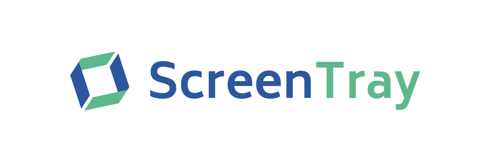
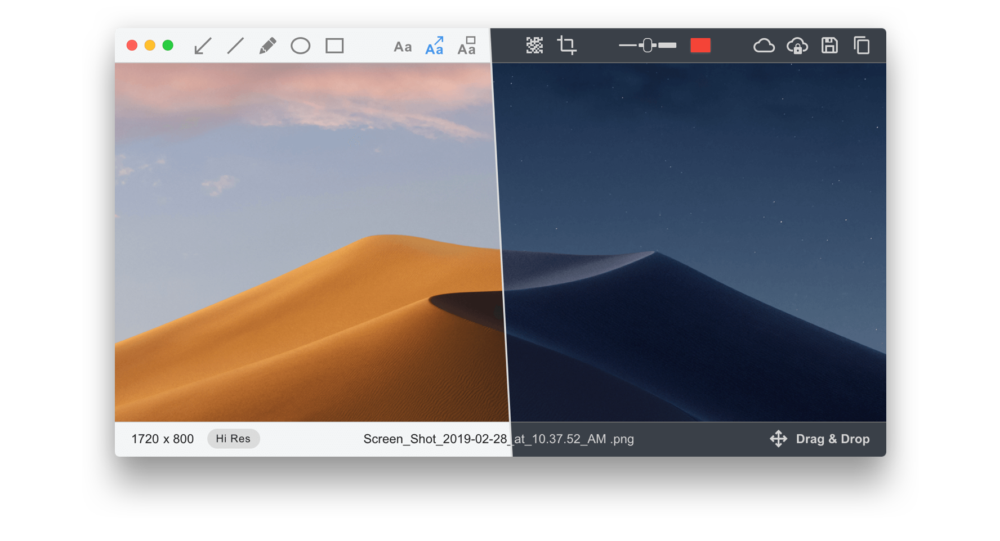

ScreenTray is a macOS application for capturing, annotating and sharing screenshots. Quickly add comments, highlight what matters or blur any sensitive content. Upload screenshots to Google Drive or Dropbox. Copy screenshots to the clipboard and paste them directly into Slack, WhatsApp, Facebook, Twitter, Gmail, Jira, Trello and lots of other apps.

Learn more at [screentray.com](https://screentray.com/)

[Watch the demo video](https://www.youtube.com/watch?v=VYhc2j5oDWE)

